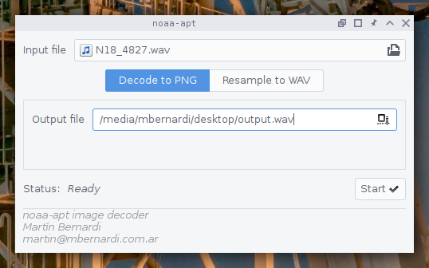
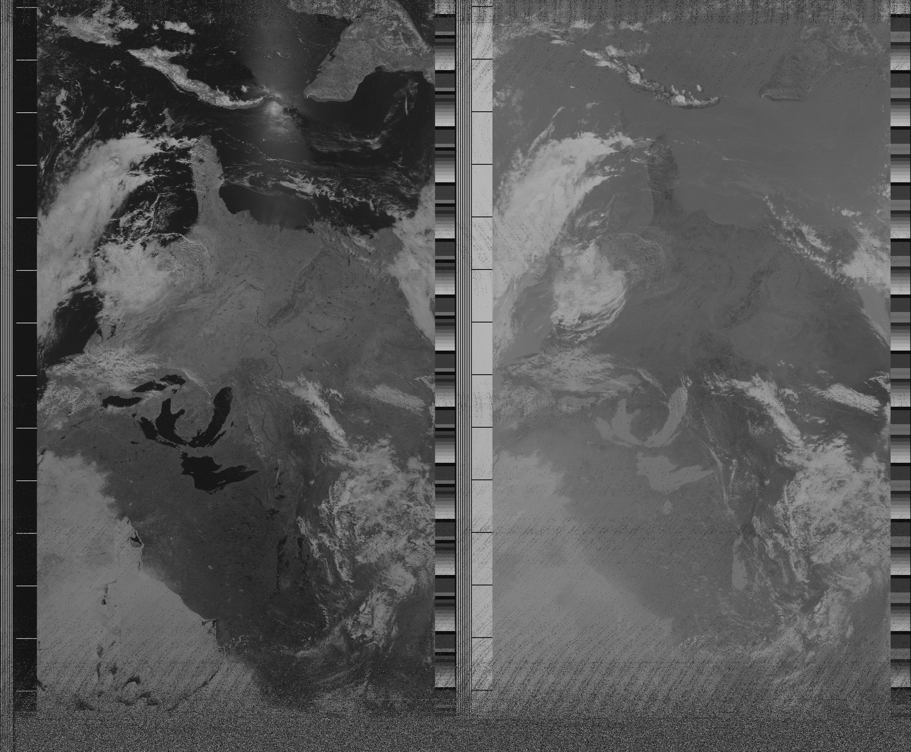
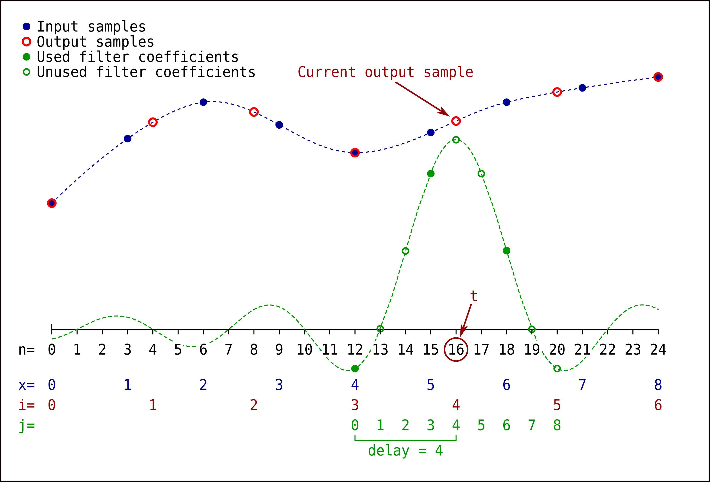

# noaa-apt

NOAA APT image decoder.

Takes a recorded WAV file (from GQRX, SDR#, etc.) and decodes the raw image.
Later you can rotate the image and adjust the contrast with something like GIMP
or Photoshop.

Works with WAV files of any sample rate, 32 bit float or 16 bit integer encoded.

Written in Rust as a learning exercise but could be useful to someone. Never
used Rust or made a GUI before. If you get some kind of error or bad result
don't hesitate to open a Issue here or to send me an email. You can try to run
the program with the `--debug` option for more info.

## Usage

### GUI

Run by clicking the executable, or from terminal without arguments. You can do
two things:

- Decode a WAV file into a PNG.

- Resample a WAV into another WAV, this is useful if you want to try a program
  like [atp-dec/apt-dec] that requires a specific sample rate.



### Terminal

```
$ ./noaa-apt --help

Usage:
    ./target/release/noaa-apt [OPTIONS] [INPUT_FILENAME]

Decode NOAA APT images from WAV files. Run without arguments to launch the GUI

positional arguments:
  input_filename        Input WAV file.

optional arguments:
  -h,--help             show this help message and exit
  -d,--debug            Print debugging messages.
  -q,--quiet            Don't print info messages.
  -o,--output FILENAME  Set output path. When decoding images the default is
                        './output.png', when resampling the default is
                        './output.wav'.
  -r,--resample SAMPLE_RATE
                        Resample WAV file to a given sample rate, no APT image
                        will be decoded.
```

## Download

You can download the binaries for Linux or Windows from the
[releases page](https://github.com/martinber/noaa-apt/releases). I've only built
binaries for 64 bits.

- Linux:

  - Version 0.9.1 binary: Doesn't have GUI, only terminal. Should work
    everywhere

  - Version 0.9.3 binary: Has GUI. Needs GLIBC version at least 2.24. I think
    you should have Ubuntu newer than Xenial, 

  - Build yourself version 0.9.3 (has GUI).

- Windows:

  - Download binary for version 0.9.3 (has GUI).

  - Build yourself version 0.9.3 (has GUI).

## Example

From a WAV file I found somewhere on Internet, the US upside down:



The output is upside down if the satellite went from south to north instead of
north to south that day.

## Alternatives

Just bought an RTL-SDR and tried to receive NOAA APT images, I'm new to this but
as of August 2018:

- [WXtoImg], by far the most popular, lots of features but the site looks dead
  forever.

- [WXtoImg Restored], unofficial mirror with installers recovered by users.

- [atp-dec/apt-dec], works really good. Keep in mind that the [1.7 release]
  looks newer than the [repo's master branch]. I tried several times to compile
  the [repo's master branch] without success, later I realized that there was a
  newer [1.7 release] and it worked.

- [zacstewart/apt-decoder], written in Python, slower than the others but really
  simple. Doesn't align the image to the sync stripes.

- [martinber/apt-decoder], bad hack made by me on top of
  [zacstewart/apt-decoder] trying to align the image to the sync stripes. Still
  slow and minor artifacts on the image if you look at the vertical stripes.

## Problems

### Syncing

This program starts a new line when it receives a sync frame (those seven white
and black stripes), works well if the signal has clear sync frames.

The first time I recorded a NOAA APT signal the bright parts had lot's of noise
(I think the FM demodulator bandwith was too narrow and had saturation when
receiving white), the sync frames were weally low quality and the alignment was
really bad.

[atp-dec/apt-dec] has the same problem. But [WXtoIMG] works perfect regardless
of the sync frames quality.

### Speed

Compared to atp-dec my program is quite slow.

## Dependencies

For running in Linux or Windows generally you don't have to install anything.
I've built everything from Linux with:

- GNU Scientific Library, only for running the tests:

  - Linux: `sudo apt install libgsl0-dev libgsl0`.

  - In Windows: Never did test there.

- GTK:

  - Linux: `sudo apt install libgtk-3-dev`.

- Docker, if you want to cross-compile to Windows

## Compiling

I never tried to compile from Windows, I cross-compile from Linux to Windows.

### Linux

**Build with `--release`, Rust does some optimizations and it works MUCH
faster. Really, otherwise it takes FOREVER.**

- Dynamically linked:

  - `cargo build --release`.

- Statically linked:

  - `rustup target add x86_64-unknown-linux-musl`.

  - `PKG_CONFIG_ALLOW_CROSS=1`.

  - `cargo build --release --target x86_64-unknown-linux-musl`.

### Cross-compile to Windows

I tried to get a mingw64-gtk environment to work on Debian without success. So I
use a Docker image I found
[here](https://github.com/LeoTindall/rust-mingw64-gtk-docker).

- Set up:

  - Install Docker.

  - Move to root folder.

  - `docker build . -t noaa-apt-build-image`.

  - `docker create -v $(pwd):/home/rustacean/src --name noaa-apt-build noaa-apt-build-image`.

- Building the package:

  - `docker start -ai noaa-apt-build`.

  - The build is on `./target/x86_64-pc-windows-gnu/package/`.


## Test

```
cargo test
```

If you get something like a wall of errors because linking with GSL fails, run
with the ``GSLv2`` feature:

```
cargo test --features GSLv2
```

## Things I should do

- Separate thread for GUI.

- Support stereo WAV files.

- The parameters used for filter design are hardcoded.

- Do tests.

- Separate GUI and no GUI builds.

## Algorithm

AM resampling and demodulation using FIR filter, following method 4 or 5 in
reference [1]:

- Load samples from WAV.

- Resample to a intermediate sample rate: 20800Hz.

  - Get L (interpolation factor) and M (decimation factor) by looking at the
    greatest common divisor (GCD) between input and output sample rates.

  - Get interpolating lowpass filter inpulse response by window method.

    - Get kaiser window.

    - Sample and window the function `sin(n*cutout)/(n*pi)`.

  - Do the equivalent of:

    - Insertion of L-1 zeros between samples.

    - Filter by doing the convolution with the impulse response.

    - Decimate by M.

- Demodulate AM signal yo get the APT signal.

  - Get hilbert filter impulse response by window method.

    - Get kaiser window.

    - Sample and window the function `1/(pi*n) * (1-cos(pi*n))`.

  - Get the imaginary part of the Analytical Signal by doing the convolution
    with the hilbert impulse response. This part adds a delay (maybe I should
    fix that).

  - Get the real part of the Analytical Signal by adding the same delay to the
    original AM signal.

  - Calculate the absolute value of each sample: `sqrt(real^2 + imag^2)`.

- Find the position of the sync frames of the APT signal (the white and black
  stripes that you can see in the final image).

  - Calculate the cross correlation between a hardcoded sync frame and the APT
    signal.

  - The peaks of that cross correlation show the locations of the sync frames in
    the APT signal.

- Map the values of the signal to numbers between 0 and 255.

- Generate the final image starting a new line on every sync frame.

## Resampling algorithm

I did something like what you can see
[here](https://ccrma.stanford.edu/~jos/resample/) but with a easier
(and slower) implementation.



For each output sample, we calculate the sum of the products between input
samples and filter coefficients.

## Notes

- Modulation:

  - The signal is modulated first on AM and then on FM.

  - FM frequencies:

    - NOAA 15: 137.62MHz.

    - NOAA 18: 137.9125MHz.

    - NOAA 19: 137.1MHz.

  - AM carrier: 2400Hz.

- APT signal:

  - 8 bits/pixel.

  - The signal amplitude represents the brightness of each pixel.

  - Two lines per second, 4160 pixels per second.

  - 2080 pixels per line, 909 useful pixels per line.

  - Each line has:

    - Sync A: Seven black and seven white pixels.

    - Space A: Some black pixels (periodically white ones too).

    - Image A: Visible/Infrared.

    - Telemetry A: For calibration I think?

    - Sync B: Some white and black pixels but I don't know the frequency.

    - Space B: Some white pixels (periodically black ones too).

    - Image B: Infrared.

    - Telemetry B: For calibration I think?

## References

- [NOAA Signal Decoding And Image Processing Using GNU-Radio][1]: About the APT
	image format.

- [Digital Envelope Detection: The Good, the Bad, and the Ugly][2]: Lists some
  AM demodulation methods.

- [Hilbert Transform Design Example][3]: How to get the analytic signal.

- [Spectral Audio Signal Processing: Digital Audio Resampling][4].

- [Impulse Response of a Hilbert Transformer][5].

- [Spectral Audio Signal Processing: Kaiser Window][6].

- [How to Create a Configurable Filter Using a Kaiser Window][7],

- [Kaiser window approximation on StackOverflow][8]: I took the Bessel function
  from there (see the infinite sum), but I think that it's slightly wrong,
  according to [this][6] that minus sign should not be there. I'm comparing my
  implementation (without the minus sign) in my tests with `rgsl::bessel::I0`
  and everything works well, that's not the case when I add that minus sign. I
  suggested an edit on the StackOverflow post and the author said me that I'm
  wrong, so now I'm confused.

- [Error Handling in Rust][9].

- [Python GTK+ 3 Tutorial][10]: For Python but I like the Widget Gallery.

- [Cross-compiling from Ubuntu to Windows with Rustup][11].

- [How to compile C GTK3+ program in Ubuntu for windows?][12].

- [rust-mingw64-gtk Docker image]: I took the Dockerfile from there.


[WXtoImg]: http://wxtoimg.com/
[WXtoImg Restored]: https://wxtoimgrestored.xyz/
[atp-dec/apt-dec]: https://github.com/csete/aptdec
[1.7 release]: https://github.com/csete/aptdec/releases
[repo's master branch]: https://github.com/csete/aptdec
[zacstewart/apt-decoder]: https://github.com/zacstewart/apt-decoder
[martinber/apt-decoder]: https://github.com/martinber/apt-decoder


[1]: https://www.researchgate.net/publication/247957486_NOAA_Signal_Decoding_And_Image_Processing_Using_GNU-Radio
[2]: https://www.dsprelated.com/showarticle/938.php
[3]: https://www.dsprelated.com/freebooks/sasp/Hilbert_Transform_Design_Example.html
[4]: https://ccrma.stanford.edu/~jos/resample/
[5]: https://flylib.com/books/en/2.729.1/impulse_response_of_a_hilbert_transformer.html
[6]: https://ccrma.stanford.edu/~jos/sasp/Kaiser_Window.html
[7]: https://tomroelandts.com/articles/how-to-create-a-configurable-filter-using-a-kaiser-window
[8]: https://dsp.stackexchange.com/questions/37714/kaiser-window-approximation/37715#37715
[9]: https://blog.burntsushi.net/rust-error-handling/
[10]: https://python-gtk-3-tutorial.readthedocs.io/en/latest/index.html
[11]: https://www.reddit.com/r/rust/comments/5k8uab/crosscompiling_from_ubuntu_to_windows_with_rustup/
[12]: https://askubuntu.com/questions/942010/how-to-compile-c-gtk3-program-in-ubuntu-for-windows
[13]: https://github.com/LeoTindall/rust-mingw64-gtk-docker

[analytic signal]: https://en.wikipedia.org/wiki/Analytic_signal
